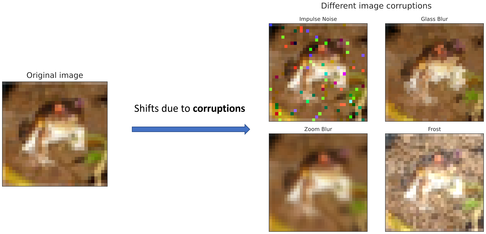
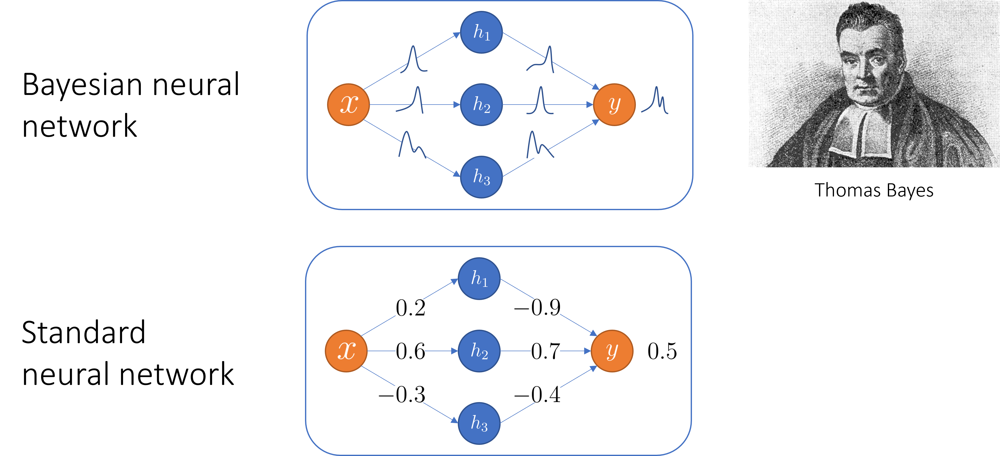
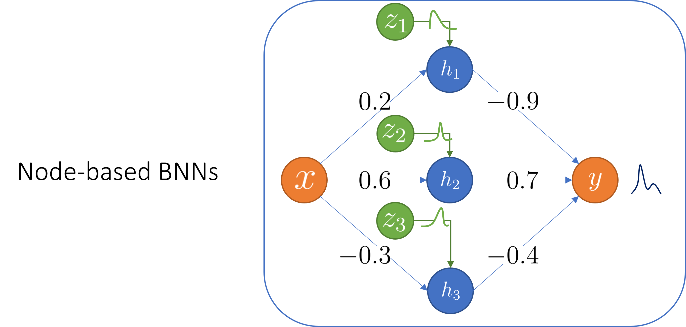
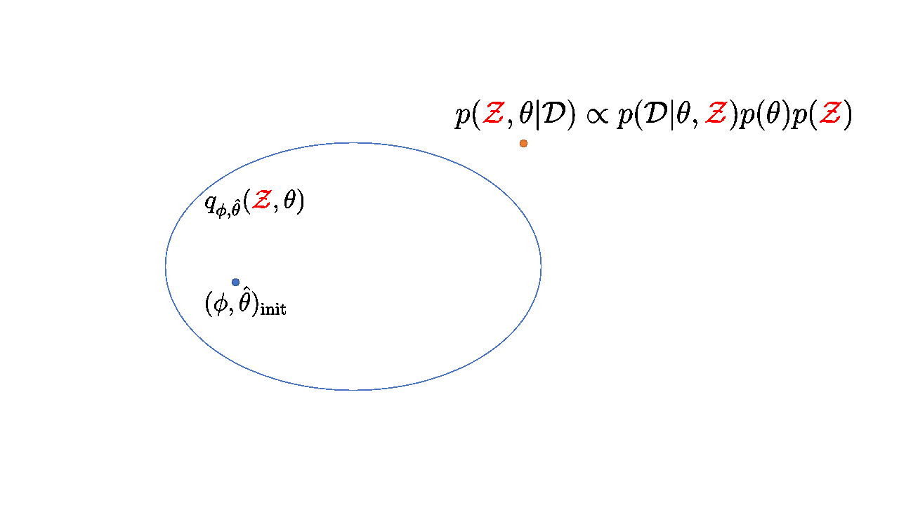
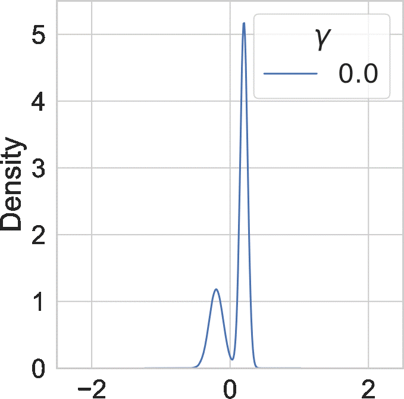

*This website contains information regarding the paper Tackling covariate shift with node-based Bayesian neural networks.*

Node-based Bayesian neural networks (node-BNNs) have demonstrated good generalization under input corruptions.

In this work, we provide insights into the robustness of node-BNNs under corruptions and propose a simple method to further improve this robustness.

# Covariate shift due to input corruptions
Generalization is a core problem in machine learning.
The standard set up in supervised learning is to fit a model to a training dataset \\(\mathcal{D}\_{train}\\) and then evaluate its generalization ability on a separate test dataset \\(\mathcal{D}\_{test}\\). Both of these datasets are assumed to contain independent and identically distributed (i.i.d.) samples from the data distribution \\(p(x)\\).

However, performance measured on \\(\mathcal{D}\_{test}\\) only reflects the model's generalization on in-distribution (ID) inputs, i.e., samples coming from \\(p(x)\\). In an open world setting, the model might encounter inputs coming from a different distribution \\(\tilde{p}(x)\\). These inputs are called out-of-distribution (OOD) samples.
The distributional difference between training and test samples is a problem called *covariate shift*.
Currently, neural networks (NNs) have excellent ID performance while behave unpredictably on OOD samples.

In this work, we focus on improving generalization of NNs under *input corruptions*, which is a form of covariate shift.
Input corruptions can happen due to noises or sensor malfunctions.
Some examples of image corruptions from CIFAR-10-C [cite] are shown below:

# Bayesian neural networks
Bayesian methods are often applied to covariate shift problems.
The standard Bayesian treatment of NNs is to place a prior distribution \\(p(\theta)\\) over the parameters \\(\theta\\) (weights and biases) and infer their posterior distribution \\(p(\theta \| \mathcal{D})\\) given the training data \\(\mathcal{D}\\) using Bayes' rule [cite]:

$$p(\theta | \mathcal{D}) \propto p(\mathcal{D}|\theta)p(\theta)$$

The resulting model is aptly named *Bayesian neural networks (BNNs)*.

Due to the large amounts of parameters in a modern NNs, it is computationally expensive to approximate the posterior \\(p(\theta \| \mathcal{D})\\). 
Furthermore, a recent work have showed that BNNs with high fidelity posterior approximations actually perform worse than maximum-a-posteriori (MAP) models under corruptions [cite].

# Node-based Bayesian neural networks
## Definition

Node-BNNs are recently introduced as an efficient alternative to standard weight-based BNNs.
In a node-BNN, we keep the weights and biases deterministic while inducing uncertainty over the outputs by multiplying hidden nodes with latent random variables:

\begin{equation}
\begin{aligned}
    \mathbf{f}^{(\ell)} (\mathbf{x}; \mathcal{Z}, \theta) = \sigma\bigg(\mathbf{W}^{(\ell)}\underbrace{(\mathbf{f}^{(\ell-1)} (\mathbf{x}; \mathcal{Z}, \theta) \circ \mathbf{z}^{(\ell)})}_{\text{Hadamard product}} + \mathbf{b}^{(\ell)} \bigg)
\end{aligned}
\end{equation}

There are two types of parameter in a node-BNN:

1. The weights and biases \\(\theta = \\{(\mathbf{W}^{(\ell)}, \mathbf{b}^{(\ell)}) \\}\_{\ell=1}^L \\) which we find a MAP estimate.
2. The latent variables \\(\mathcal{Z} = \\{ \mathbf{z}^{(\ell)} \\}\_{\ell=1}^L \\) which we infer the posterior distribution.

As the number of nodes is much smaller than the number of weights, it is easier to train a node-BNN than a weight-BNN since we significantly decrease the size of the posterior to be inferred.

## Training method

We use variational inference to train a node-BNN.
We approximate the complex joint posterior \\( p(\theta, \mathcal{Z} \| \mathcal{D})\\) using a simpler parametric distribution \\( q\_{\hat{\theta}, \phi}(\theta, \mathcal{Z}) \\):
\begin{equation}
\begin{aligned}
    q_{\hat{\theta}, \phi}(\theta, \mathcal{Z}) = q_{\hat{\theta}}(\theta)q_{\phi}(\mathcal{Z}) = \delta(\theta-\hat{\theta})q_{\phi}(\mathcal{Z})
\end{aligned}
\end{equation}
where:
- \\(q_{\hat{\theta}}(\theta) = \delta(\theta-\hat{\theta})\\) is a Dirac delta measure and \\(\hat{\theta}\\) is the MAP estimation of \\(\theta\\).
- \\(q_{\phi}(\mathcal{Z})\\) is a mixture of Gaussians.

Here \\( q\_{\hat{\theta}, \phi}(\theta, \mathcal{Z}) \\) is called the variational posterior and \\((\hat{\theta}, \phi)\\) are the variational parameters.

Our goal is to find \\( (\hat{\theta}, \phi) \\) minimizing \\( \mathrm{KL}[q\_{\hat{\theta}, \phi}(\theta, \mathcal{Z}) \|\| p(\theta, \mathcal{Z} \| \mathcal{D})]\\), which is equivalent to maximizing the evidence lower-bound (ELBO):

\begin{equation}\label{eq:elbo}
    \underbrace{\mathcal{L}(\hat{\theta}, \phi)}\_{\text{ELBO}} = \underbrace{\mathbb{E}\_{q\_{\phi}(\mathcal{Z})}[\log p(\mathcal{D} \| \hat{\theta}, \mathcal{Z})]}\_{\text{expected log-likelihood}} - \underbrace{\mathrm{KL}[q\_{\phi}(\mathcal{Z}) \|\| p(\mathcal{Z})]}\_{\text{KL divergence}} + \underbrace{\log p(\hat{\theta})}\_{\text{log weight prior}}
\end{equation}

# Why are node-BNNs robust against input corruptions?

> **Proposition**: We theorize that the latent distribution (the distribution of the latent variables) \\( p(\mathcal{Z}) \\) induces a distribution of *implicit corruptions* \\(p(\mathbf{x}^{c})\\) in the input space, and by training under these faux corruptions, node-BNNs become robust against natural corruptions.

## Approximating the implicit corruptions

If we consider each corrupted input \\( \mathbf{x}^c \\) as a sum of the original input \\( \mathbf{x} \\) and a corruption mask \\(\mathbf{m}\\)

then given a sample \\( \tilde{\mathcal{Z}} \sim p(\mathcal{Z}) \\), our objective is to find a corruption mask \\( \tilde{\mathbf{m}} \\) such that:

\begin{equation}
    \mathbf{f}(\mathbf{x}; \mathcal{Z}) = \hat{\mathbf{f}}(\mathbf{x} + \tilde{\mathbf{m}})
\end{equation}

However, this objective does not have a closed-form solution due to the non-linearity of the NN. Thus, one can approximate \\( \tilde{\mathbf{m}} \\) by minimizing the following loss function using gradient descent:

\begin{equation}
    \tilde{\mathbf{m}} \approx \operatorname*{argmin}\_{\mathbf{m}} \underbrace{\frac{1}{2} \|\|\mathbf{f}(\mathbf{x}; \mathcal{Z}) - \hat{\mathbf{f}}(\mathbf{x} + \mathbf{m}) \|\|\_{2}^{2}}\_{\text{Output matching}} + \underbrace{\frac{\lambda}{2} \|\| \mathbf{m} \|\|\_{2}^{2}}\_{\text{L2-regularization}}
\end{equation}

Below, we visualize the corruption masks of some images from the CIFAR-10 dataset.

# Improving robustness using entropic regularization

> **Proposition**: Since the latent distribution induces a distribution of implicit corruptions in the input space, we theorize that increasing the entropy of the latent variables will diversify these corruptions, thereby enhancing the robustness of node-BNNs against natural corruptions.

## The \\(\gamma\\)-ELBO

To encourage high latent entropy (the entropy of the latent variables), we add the \\(\gamma-\\)entropy term to the original ELBO in \\(\eqref{eq:elbo}\\). We call this new objective the \\(\gamma\\)-ELBO:

\begin{align}\label{eq:gamma_elbo}
    \underbrace{\mathcal{L}\_{\gamma}(\hat{\theta}, \phi)}\_{\text{The }\gamma-\text{ELBO}}
    &= \underbrace{\mathcal{L}(\hat{\theta}, \phi)}\_{\text{The original ELBO}} +  \underbrace{\gamma \mathbb{H}[q\_\phi(\mathcal{Z})]}\_{\text{The }\gamma-\text{entropy}} \newline
    &= \underbrace{\mathbb{E}\_{q\_{\phi}(\mathcal{Z})}[\log p(\mathcal{D} \| \hat{\theta}, \mathcal{Z})]}\_{\text{expected log-likelihood}} - \underbrace{\mathbb{H}[q\_\phi(\mathcal{Z}), p(\mathcal{Z})]}\_{\text{cross entropy}} + \underbrace{(\gamma+1)\mathbb{H}[q\_\phi(\mathcal{Z})]}\_{\text{variational entropy}} + \underbrace{\log p(\hat{\theta})}\_{\text{log weight prior}}
\end{align}

By maximizing the \\(\gamma-\\)ELBO with \\(\gamma > 0 \\), we balance between approximating the true posterior (via maximizing the original ELBO) and maximizing the latent entropy, with higher \\(\gamma\\) results in higher latent entropy.

## Connection to tempered posterior inference

It turns out that maximizing the \\(\gamma-\\)ELBO in \\(\eqref{eq:gamma_elbo}\\) is equivalent to minimizing the KL divergence between the variational posterior and a tempered true posterior:
\begin{equation}
    \mathrm{KL}[q\_{\hat{\theta},\phi}(\theta, \mathcal{Z}) \|\| p\_\gamma(\theta, \mathcal{Z} \| \mathcal{D})]
\end{equation}
where
\begin{equation}
    p\_\gamma(\theta, \mathcal{Z} \| \mathcal{D}) \propto p(\mathcal{D} \| \theta, \mathcal{Z})^{1/(\gamma+1)} p(\theta, \mathcal{Z})^{1/(\gamma+1)}
\end{equation}
Here both the likelihood and the prior are tempered with a temperature \\( \tau = \gamma + 1 \\).

Since \\( \gamma > 0 \\), we have the temperature \\(\tau > 1 \\). In this case, we call the tempered posterior *hot posterior*. We visualize the effect of using a temperature \\(\tau\\) larger than 1 on an example distribution below:

Overall, larger \\(\tau\\) makes the probability mass of the distribution less concentrated.

Interestingly, hot posteriors have been used in classical Bayesian statistics to alleviate model misspecification [cite]. One can view covariate shift as a model misspecification problem, since we use a model trained under different assumptions about the statistics of the data.

# Experiments

# Conclusions

## References

