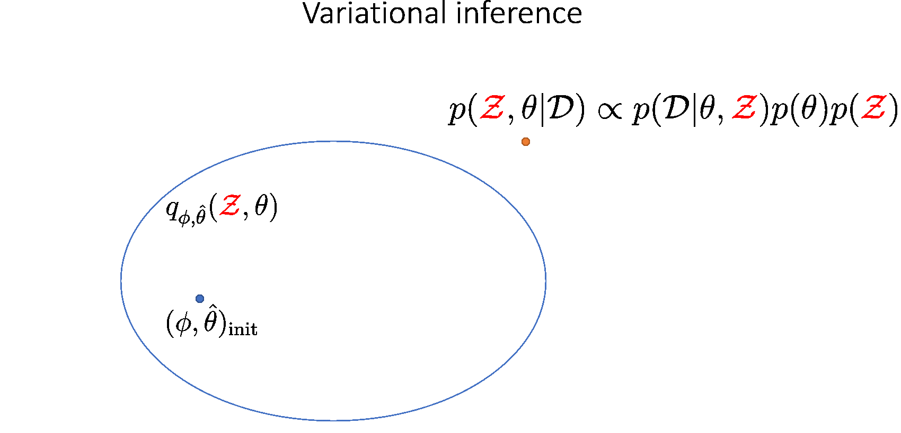
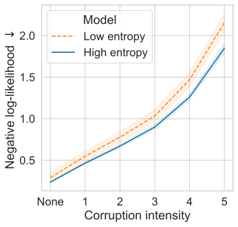
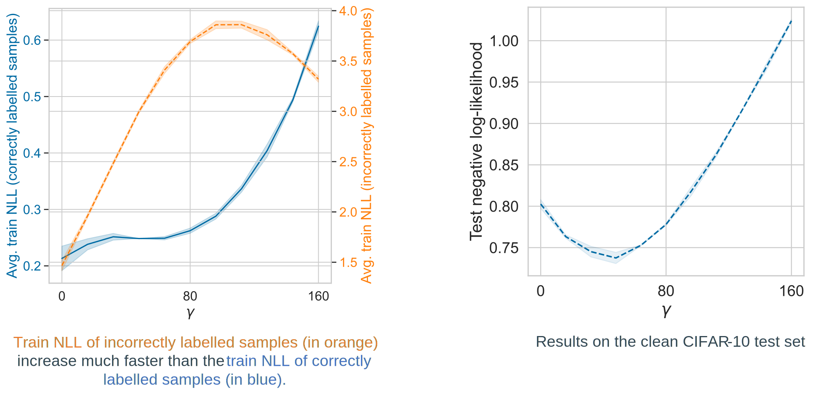

*This website contains information regarding the paper Tackling covariate shift with node-based Bayesian neural networks.*

> **TL;DR**: Node-based Bayesian neural networks (node-BNNs) have demonstrated good generalization under input corruptions. In this work, we provide insights into the robustness of node-BNNs under corruptions and propose a simple method to further improve this robustness.

# Covariate shift due to input corruptions
Generalization is a core problem in machine learning.
The standard set up in supervised learning is to fit a model to a training dataset \\(\mathcal{D}\_{train}\\) and then evaluate its generalization ability on a separate test dataset \\(\mathcal{D}\_{test}\\). Both of these datasets are assumed to contain independent and identically distributed (i.i.d.) samples from the data distribution \\(p(x)\\).

However, performance measured on \\(\mathcal{D}\_{test}\\) only reflects the model's generalization on in-distribution (ID) inputs, i.e., samples coming from \\(p(x)\\). In an open world setting, the model might encounter inputs coming from a different distribution \\(\tilde{p}(x)\\). These inputs are called out-of-distribution (OOD) samples.
The distributional difference between training and test samples is a problem called *covariate shift*.
Currently, neural networks (NNs) have excellent ID performance while behave unpredictably on OOD samples.

In this work, we focus on improving generalization of NNs under *input corruptions*, which is a form of covariate shift.
Input corruptions can happen due to noises or sensor malfunctions.
Some examples of image corruptions from CIFAR-10-C [1] are shown below:

# Bayesian neural networks
Bayesian methods are often applied to covariate shift problems.
The standard Bayesian treatment of NNs is to place a prior distribution \\(p(\theta)\\) over the parameters \\(\theta\\) (weights and biases) and infer their posterior distribution \\(p(\theta \| \mathcal{D})\\) given the training data \\(\mathcal{D}\\) using Bayes' rule [2]:

$$p(\theta | \mathcal{D}) \propto p(\mathcal{D}|\theta)p(\theta)$$

The resulting model is aptly named *Bayesian neural networks (BNNs)*.

Due to the large amounts of parameters in a modern NNs, it is computationally expensive to approximate the posterior \\(p(\theta \| \mathcal{D})\\). 
Furthermore, a recent work have showed that BNNs with high fidelity posterior approximations actually perform worse than maximum-a-posteriori (MAP) models under corruptions [3].

# Node-based Bayesian neural networks
## Definition

Node-BNNs are recently introduced as an efficient alternative to standard weight-based BNNs. Examples of node-BNNs include MC-Dropout [4] and Rank-1 BNNs [5].
In a node-BNN, we keep the weights and biases deterministic while inducing uncertainty over the outputs by multiplying hidden nodes with latent random variables:

\begin{equation}
\begin{aligned}
    \mathbf{f}^{(\ell)} (\mathbf{x}; \mathcal{Z}, \theta) = \sigma\bigg(\mathbf{W}^{(\ell)}\underbrace{(\mathbf{f}^{(\ell-1)} (\mathbf{x}; \mathcal{Z}, \theta) \circ \mathbf{z}^{(\ell)})}_{\text{Hadamard product}} + \mathbf{b}^{(\ell)} \bigg)
\end{aligned}
\end{equation}

There are two types of parameter in a node-BNN:

1. The weights and biases \\(\theta = \\{(\mathbf{W}^{(\ell)}, \mathbf{b}^{(\ell)}) \\}\_{\ell=1}^L \\) which we find a MAP estimate.
2. The latent variables \\(\mathcal{Z} = \\{ \mathbf{z}^{(\ell)} \\}\_{\ell=1}^L \\) which we infer the posterior distribution.

As the number of nodes is much smaller than the number of weights, it is easier to train a node-BNN than a weight-BNN since we significantly decrease the size of the posterior to be inferred.

## Training method

We use variational inference to train a node-BNN.
We approximate the complex joint posterior \\( p(\theta, \mathcal{Z} \| \mathcal{D})\\) using a simpler parametric distribution \\( q\_{\hat{\theta}, \phi}(\theta, \mathcal{Z}) \\):
\begin{equation}
\begin{aligned}
    q_{\hat{\theta}, \phi}(\theta, \mathcal{Z}) = q_{\hat{\theta}}(\theta)q_{\phi}(\mathcal{Z}) = \delta(\theta-\hat{\theta})q_{\phi}(\mathcal{Z})
\end{aligned}
\end{equation}
where:
- \\(q_{\hat{\theta}}(\theta) = \delta(\theta-\hat{\theta})\\) is a Dirac delta measure and \\(\hat{\theta}\\) is the MAP estimation of \\(\theta\\).
- \\(q_{\phi}(\mathcal{Z})\\) is a mixture of Gaussians.

Here \\( q\_{\hat{\theta}, \phi}(\theta, \mathcal{Z}) \\) is called the variational posterior and \\((\hat{\theta}, \phi)\\) are the variational parameters.

Our goal is to find \\( (\hat{\theta}, \phi) \\) minimizing \\( \mathrm{KL}[q\_{\hat{\theta}, \phi}(\theta, \mathcal{Z}) \|\| p(\theta, \mathcal{Z} \| \mathcal{D})]\\), which is equivalent to maximizing the evidence lower-bound (ELBO):

\begin{equation}\label{eq:elbo}
    \underbrace{\mathcal{L}(\hat{\theta}, \phi)}\_{\text{ELBO}} = \underbrace{\mathbb{E}\_{q\_{\phi}(\mathcal{Z})}[\log p(\mathcal{D} \| \hat{\theta}, \mathcal{Z})]}\_{\text{expected log-likelihood}} - \underbrace{\mathrm{KL}[q\_{\phi}(\mathcal{Z}) \|\| p(\mathcal{Z})]}\_{\text{KL divergence}} + \underbrace{\log p(\hat{\theta})}\_{\text{log weight prior}}
\end{equation}

# Why are node-BNNs robust against input corruptions?

> **Proposition**: We theorize that the latent distribution (the distribution of the latent variables) \\( p(\mathcal{Z}) \\) induces a distribution of *implicit corruptions* \\(p(\mathbf{x}^{c})\\) in the input space, and by training under these faux corruptions, node-BNNs become robust against natural corruptions.

Given a node-BNN with a MAP estimate \\(\hat{\theta} \\) and a latent distribution \\(p(\mathcal{Z}) \\), there exists a distribution \\(p(\mathbf{x}^{c})\\) such that the output distribution of the following two models are equal:

where \\(\hat{\mathbf{f}}(\cdot; \hat{\theta}) = \mathbf{f}(\cdot; \mathcal{Z} = \mathbf{1}, \hat{\theta}) \\) is the deterministic NN obtained by removing all the latent variables in the node-BNN. 

## Approximating the implicit corruptions

If we consider each corrupted input \\( \mathbf{x}^c \\) as a sum of the original input \\( \mathbf{x} \\) and a corruption mask \\(\mathbf{m}\\)

then given a sample \\( \tilde{\mathcal{Z}} \sim p(\mathcal{Z}) \\), our objective is to find a corruption mask \\( \tilde{\mathbf{m}} \\) such that:

\begin{equation}
    \mathbf{f}(\mathbf{x}; \mathcal{Z} = \tilde{\mathcal{Z}}, \hat{\theta}) = \hat{\mathbf{f}}(\mathbf{x} + \tilde{\mathbf{m}}; \hat{\theta})
\end{equation}

However, this objective does not have a closed-form solution due to the non-linearity of the NN. Thus, one can approximate \\( \tilde{\mathbf{m}} \\) by minimizing the following loss function using gradient descent:

\begin{equation}
    \tilde{\mathbf{m}} \approx \operatorname*{argmin}\_{\mathbf{m}} \underbrace{\frac{1}{2} \|\|\mathbf{f}(\mathbf{x}; \mathcal{Z} = \tilde{\mathcal{Z}}, \hat{\theta}) - \hat{\mathbf{f}}(\mathbf{x} + \tilde{\mathbf{m}}; \hat{\theta}) \|\|\_{2}^{2}}\_{\text{Output matching}} + \underbrace{\frac{\lambda}{2} \|\| \mathbf{m} \|\|\_{2}^{2}}\_{\text{L2-regularization}}
\end{equation}

Below, we visualize the corruption masks of some images from the CIFAR-10 dataset from a node-BNN with a simple ConvNet architecture:

| Image | Corruption mask |
| ------ | --------------- |
|  |  |
|  |  |
|  |  |

We can see that \\(\lambda \\) controls the severities of the corruptions with higher \\(\lambda\\) corresponding to lower severities.

# Improving robustness using entropic regularization

> **Proposition**: Since the latent distribution induces a distribution of implicit corruptions in the input space, we theorize that increasing the entropy of the latent variables will diversify these corruptions, thereby enhancing the robustness of node-BNNs against natural corruptions.

## The \\(\gamma\\)-ELBO

To encourage high latent entropy (the entropy of the latent variables), we add the \\(\gamma-\\)entropy term to the original ELBO in \\(\eqref{eq:elbo}\\). We call this new objective the \\(\gamma\\)-ELBO:

\begin{align}\label{eq:gamma_elbo}
    \underbrace{\mathcal{L}\_{\gamma}(\hat{\theta}, \phi)}\_{\text{The }\gamma-\text{ELBO}}
    &= \underbrace{\mathcal{L}(\hat{\theta}, \phi)}\_{\text{The original ELBO}} +  \underbrace{\gamma \mathbb{H}[q\_\phi(\mathcal{Z})]}\_{\text{The }\gamma-\text{entropy}} \newline
    &= \underbrace{\mathbb{E}\_{q\_{\phi}(\mathcal{Z})}[\log p(\mathcal{D} \| \hat{\theta}, \mathcal{Z})]}\_{\text{expected log-likelihood}} - \underbrace{\mathbb{H}[q\_\phi(\mathcal{Z}), p(\mathcal{Z})]}\_{\text{cross entropy}} + \underbrace{(\gamma+1)\mathbb{H}[q\_\phi(\mathcal{Z})]}\_{\text{variational entropy}} + \underbrace{\log p(\hat{\theta})}\_{\text{log weight prior}}
\end{align}

By maximizing the \\(\gamma-\\)ELBO with \\(\gamma > 0 \\), we balance between approximating the true posterior (via maximizing the original ELBO) and maximizing the latent entropy, with higher \\(\gamma\\) results in higher latent entropy.

## Connection to tempered posterior inference

It turns out that maximizing the \\(\gamma-\\)ELBO in \\(\eqref{eq:gamma_elbo}\\) is equivalent to minimizing the KL divergence between the variational posterior and a tempered true posterior:
\begin{equation}
    \mathrm{KL}[q\_{\hat{\theta},\phi}(\theta, \mathcal{Z}) \|\| p\_\gamma(\theta, \mathcal{Z} \| \mathcal{D})]
\end{equation}
where
\begin{equation}
    p\_\gamma(\theta, \mathcal{Z} \| \mathcal{D}) \propto p(\mathcal{D} \| \theta, \mathcal{Z})^{1/(\gamma+1)} p(\theta, \mathcal{Z})^{1/(\gamma+1)}
\end{equation}
Here both the likelihood and the prior are tempered with a temperature \\( \tau = \gamma + 1 \\).

Since \\( \gamma > 0 \\), we have the temperature \\(\tau > 1 \\). In this case, we call the tempered posterior *hot posterior*. We visualize the effect of \\(\gamma\\) on an example distribution below:

Overall, larger \\(\gamma\\) makes the probability mass of the distribution less concentrated.

Interestingly, hot posteriors have been used in classical Bayesian statistics to alleviate model misspecification [6]. One can view covariate shift as a model misspecification problem, since we use a model trained under different assumptions about the statistics of the data.

# Experiments

## Small experiments

In the small experiments, we compare the corruption robustness of two node-BNNs with a simple ConvNet architecture. One model has a low latent entropy and the other has a higher latent entropy. We trained both models on CIFAR-10 [7] and evaluated them on CIFAR-10-C [1] consisting of the corrupted versions of the images from the test set of CIFAR-10. **In the plot below, we can see that the high latent entropy model is indeed more robust against corruptions than the low latent entropy model.**

Since one can approximate the implicit corruptions of a model as shown [above](#approximating-the-implicit-corruptions), we use each model to generate a set of implicit corruptions, and then evaluate each model on its own generated corruptions to confirm whether or not each model is robust against its own corruptions.

The plot above shows that **in this experiment, each model is indeed robust against its own implicit corruptions, as evidenced by the small uniform degradations in performance under different \\(\lambda\\)**.

Next, we evaluate each model on the corruptions generated by the other model. The plot above shows that **the high entropy model is more robust against the corruptions of the low entropy model than vice versa**.

These results support our hypothesis that maximizing the latent entropy improves corruption robustness.

## Effect of \\(\gamma\\) on corruption robustness

In this experiment, we train node-BNNs with the VGG-16 architecture [8] on CIFAR-100 [7] and evaluate them on CIFAR-100-C [1]. Below, we visualize the NLL of these models as a function of \\(\gamma\\) under different corruption severities, where \\(K\\) is the number of Gaussian components in \\(q_\phi(\mathcal{Z})\\).

These plots show that for under all corruption severities and different \\(K\\), performance improves as \\(\gamma\\) increases up to an optimal value and then degrades afterwards. More severe corruptions require higher optimal \\(\gamma\\) as shown in the right most plot.

> **Remark**: The latent entropy controls the trade-off between performance on in-distribution (ID) samples and out-of-distribution (OOD) performance, with more severe corruptions require higher latent entropy which in turn decreases the ID performance.

## Robust learning against label noises

> **Proposition**: Learning generalizable patterns from correctly labelled samples is easier than memorizing random patterns from wrongly labelled samples [9]. Thus, if we corrupt wrongly labelled samples with sufficiently diverse corruptions then the model will fail to memorize these spurious patterns.

To test this hypothesis, we trained a node-BNN with the ResNet18 architecture [10] on CIFAR-10 [7] where we randomly selected 40% of the training samples and corrupted their labels. On the left plot, we show the average NLL of the training samples with correct and incorrect labels separately. The high avg. NLL of training samples with noisy labels at high \\(\gamma\\) indicates that the model fails to memorize these samples.
Hence, the model achieves better generalization on the clean test set at high \\(\gamma\\), as shown on the right plot.

## Benchmark results

Results of PreActResNet18 [11] on TinyImageNet [12]. We chose SWAG [13] and cSG-HMC [14] as weight-based BNN baselines. Overall, the entropy regularized node-BNN performs best under corruptions in all metrics and is only worse than the baselines in expected calibration error on corruption level 0 and 1.

# Conclusions

> 1. The distribution of the latent variables induces a distribution of implicit corruptions in the input space and by training under these corruptions, a node-BNN becomes robust against natural corruptions.
> 2. Increasing the latent entropy (the entropy of the latent variables) diversifies the implicit corruptions, thereby improving the corruption robustness of the node-BNN.
> 3. The latent entropy controls the induced trade-off between ID performance and generalization under corruptions, with more severe corruptions require a higher latent entropy which in turn decreases ID performance.
> 4. As a side effect, a high latent entropy also provides robust learning under noisy training labels.

## References

[1] D. Hendrycks and T. Dietterich, “Benchmarking Neural Network Robustness to Common Corruptions and Perturbations,” arXiv:1903.12261 [cs, stat], Mar. 2019, Accessed: Apr. 29, 2021. [Online]. Available: http://arxiv.org/abs/1903.12261

[2] R. M. Neal, Bayesian Learning for Neural Networks, vol. 118. New York, NY: Springer New York, 1996. doi: 10.1007/978-1-4612-0745-0.

[3] P. Izmailov, S. Vikram, M. D. Hoffman, and A. G. Wilson, “What Are Bayesian Neural Network Posteriors Really Like?,” arXiv:2104.14421 [cs, stat], Apr. 2021, Accessed: May 10, 2021. [Online]. Available: http://arxiv.org/abs/2104.14421

[4] Y. Gal and Z. Ghahramani, “Dropout as a Bayesian Approximation: Representing Model Uncertainty in Deep Learning,” in Proceedings of The 33rd International Conference on Machine Learning, New York, New York, USA, Jun. 2016, vol. 48, pp. 1050–1059. [Online]. Available: https://proceedings.mlr.press/v48/gal16.html

[5] M. Dusenberry et al., “Efficient and Scalable Bayesian Neural Nets with Rank-1 Factors,” in Proceedings of the 37th International Conference on Machine Learning, Jul. 2020, vol. 119, pp. 2782–2792. [Online]. Available: https://proceedings.mlr.press/v119/dusenberry20a.html

[6] P. Grünwald, “The Safe Bayesian,” in Algorithmic Learning Theory, Berlin, Heidelberg, 2012, pp. 169–183. doi: 10.1007/978-3-642-34106-9_16.

[7] A. Krizhevsky, V. Nair, and G. Hinton, “CIFAR-10 and CIFAR-100 datasets,” URL: https://www.cs.toronto.edu/kriz/cifar.html, 2009.

[8] K. Simonyan and A. Zisserman, “Very deep convolutional networks for large-scale image recognition,” arXiv preprint arXiv:1409.1556, 2014.

[9] D. Arpit et al., “A Closer Look at Memorization in Deep Networks,” in Proceedings of the 34th International Conference on Machine Learning, Aug. 2017, vol. 70, pp. 233–242. [Online]. Available: https://proceedings.mlr.press/v70/arpit17a.html

[10] K. He, X. Zhang, S. Ren, and J. Sun, “Deep residual learning for image recognition,” in Proceedings of the IEEE conference on computer vision and pattern recognition, 2016, pp. 770–778.

[11] K. He, X. Zhang, S. Ren, and J. Sun, “Identity Mappings in Deep Residual Networks,” in Computer Vision – ECCV 2016, Cham, 2016, pp. 630–645.

[12] Y. Le and X. S. Yang, “Tiny ImageNet Visual Recognition Challenge,” 2015.

[13] W. J. Maddox, P. Izmailov, T. Garipov, D. P. Vetrov, and A. G. Wilson, “A Simple Baseline for Bayesian Uncertainty in Deep Learning,” in Advances in Neural Information Processing Systems, 2019, vol. 32. [Online]. Available: https://proceedings.neurips.cc/paper/2019/file/118921efba23fc329e6560b27861f0c2-Paper.pdf

[14] R. Zhang, C. Li, J. Zhang, C. Chen, and A. G. Wilson, “Cyclical Stochastic Gradient MCMC for Bayesian Deep Learning,” 2020. [Online]. Available: https://openreview.net/forum?id=rkeS1RVtPS

